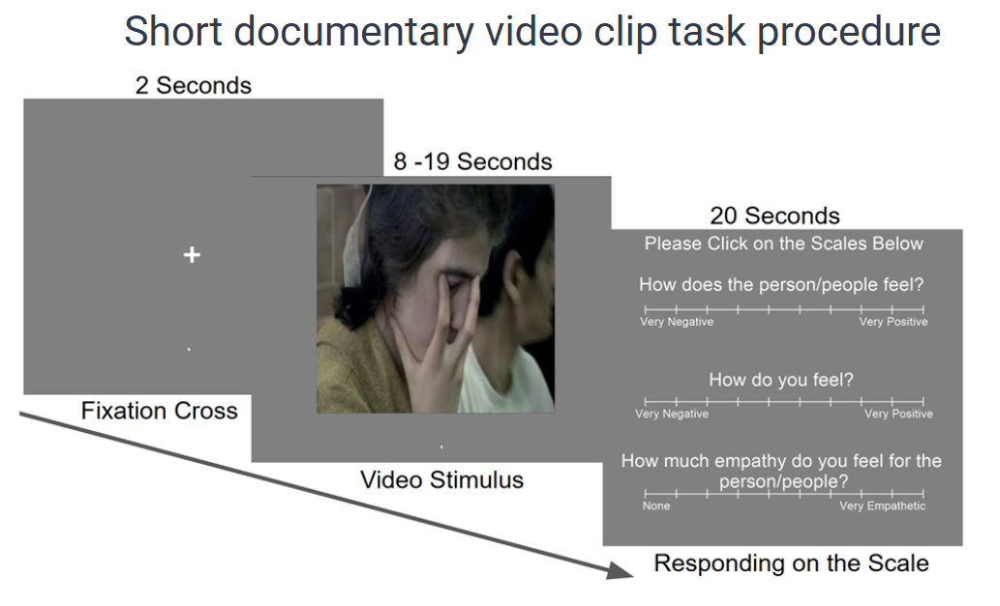
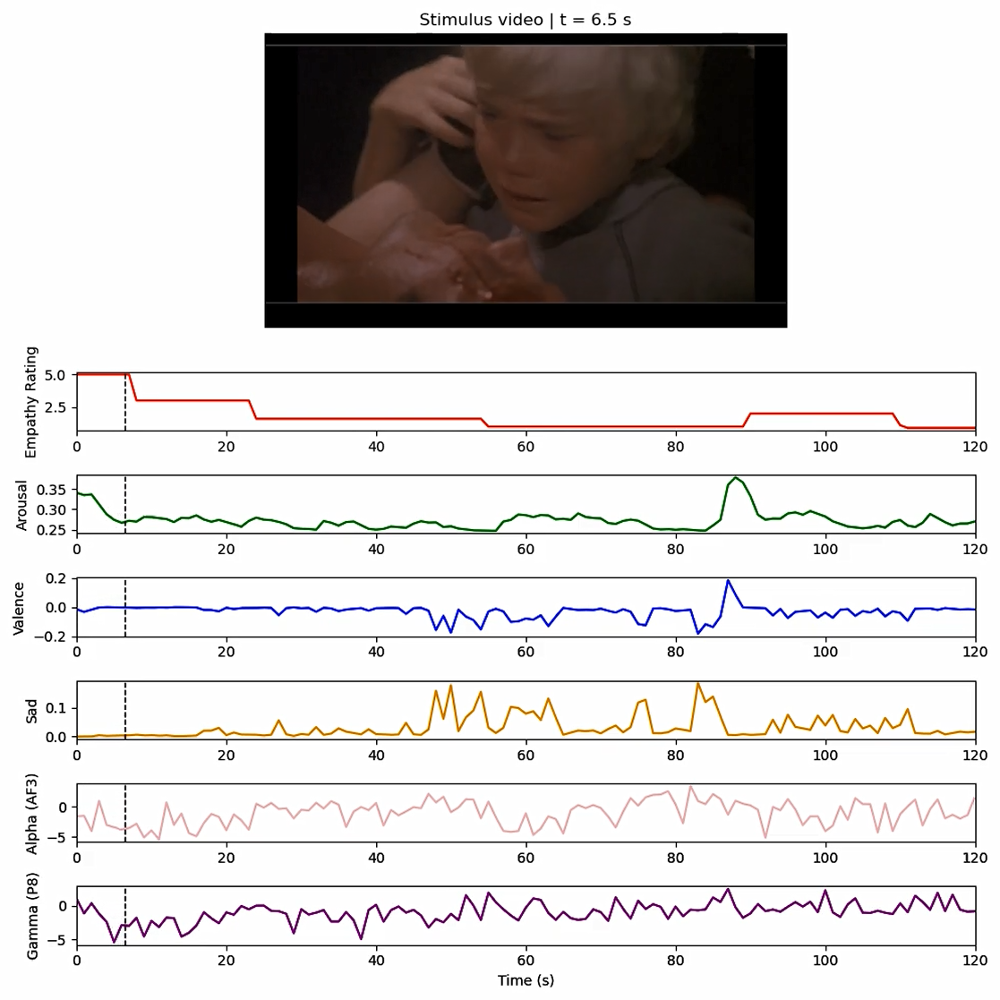
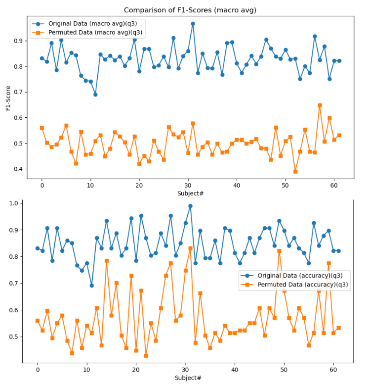
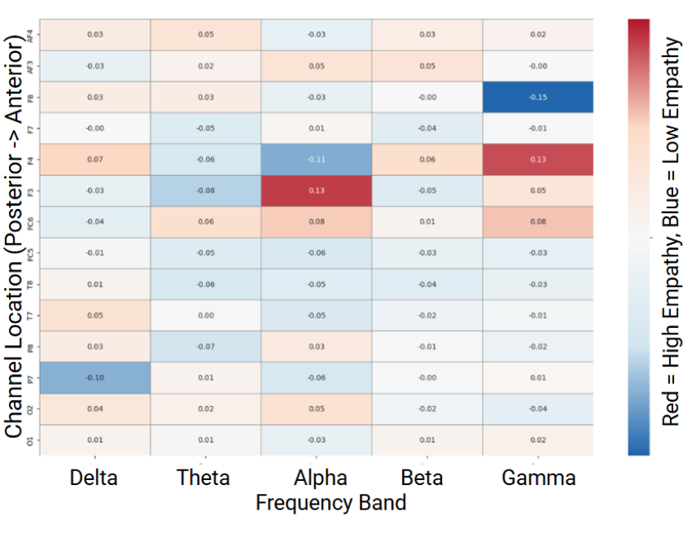
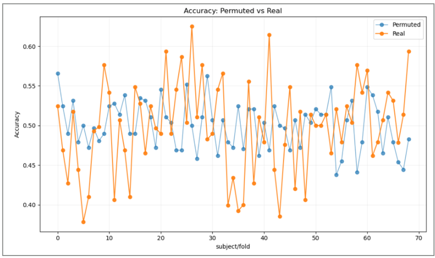

# Multimodal Emotion & Empathy Prediction from EEG and Facial Expressions

This project investigates how neural activity and facial expressions relate to emotion perception and empathy during video viewing. The pipeline integrates **EEG signals**, **facial-expression analysis**, and **behavioral ratings** to build machine learning models that predict participants’ emotional responses.

## Experiment Design

Participants viewed emotionally evocative video clips while EEG and behavioral responses were recorded.

Procedure:
- **Practice task (60s):** Participants rated emotional valence while watching a positive video scene.
- **Emotional Movie Clip task (170s):** A sad clip from *The Champ* was shown to induce empathic arousal.
- **Main Task: Short documentary video clip task (36 clips):**
  - 16 clips depicting moderately painful experiences
  - 20 neutral clips  
  Each trial began with a 2-second fixation cross followed by a video stimulus.

  

*Figure: Experimental procedure for the short documentary video task.*

Participants provided continuous slider ratings during viewing.

## Data Sources

The analysis combines three synchronized data streams:

- **EEG recordings** (EDF files from portable EEG headset)
- **Facial expressions** extracted from videos using Noldus FaceReader
- **Behavioral ratings** collected with PsychoPy

## Pipeline Overview

## EEG Preprocessing

Raw EEG signals were processed using the **HAPPE pipeline** and EEGLAB.

Steps include:

- Rename raw EDF files (`rename_original_edf.m`)
- Convert EDF → EEGLAB `.set` (`edf_to_eeg.m`)
- Artifact removal with HAPPE
- Extract original event markers (`get_original_event_marker.m`)
- Create behavioral event markers (`Make_4qs_ttls.ipynb`)
- Apply markers and generate cleaned datasets
- Perform baseline correction (`Study2_baseline_correction.ipynb`)

## Feature Extraction

EEG features were computed to capture neural dynamics:

- **Band-power time series** (`make_power_time_series.m`)
- **Entropy features** (`make_time_series_entropy_final.m`)
- Channel relabeling and feature aggregation (`rename_channel_and_combine.ipynb`)

Facial-expression metrics (valence and basic emotions) were extracted frame-by-frame using **FaceReader** and aligned with EEG timestamps.

## Prediction Tasks

Machine learning models were trained to predict participants’ emotional responses:

- **Q1:** Perceived emotion of the characters in the ducumentary video clips
- **Q2:** Participants' emotional response
- **Q3:** Empathy toward the characters

Modeling scripts:

- `Prediction_model_within_subject_v6.ipynb` – within-subject prediction
- `Prediction_model_cross_subject_v3.ipynb` – leave-one-subject-out cross-validation

Main model: Linear SVM.
## Results
**Example Multimodal Data Streams**

The following example shows synchronized video stimulus, EEG signals, and extracted time-series features of one participant for the Emotional Movie Clip task. Demo video uploaded to the repository.

  

### Prediction Results for the documentary video trials

**Within-Subject Empathy Prediction**

  

The model achieved strong within-subject performance (F1 = 0.83), significantly outperforming permutation baselines (p < .001).

**Feature Importance**

  

The heatmap shows the importance of EEG frequency bands across channels for predicting empathy responses. Feature importance analysis suggests that frontal EEG alpha and gamma activity are key predictors of empathy responses.

**Cross-Subject Prediction (LOSO)**

  

Cross-subject prediction using leave-one-subject-out validation did not exceed chance performance, suggesting substantial individual variability in empathy-related neural patterns.

## Libraries and Toolboxes

- **Python:** NumPy, Pandas, scikit-learn, SciPy, Matplotlib  
- **MATLAB:** EEGLAB, HAPPE EEG preprocessing pipeline  
- **Other tools:** PsychoPy, Noldus FaceReader

## Goal

The project demonstrates how **multimodal time-series data (EEG + facial expressions + behavioral ratings)** can be integrated to model emotional perception and empathy using machine learning.

